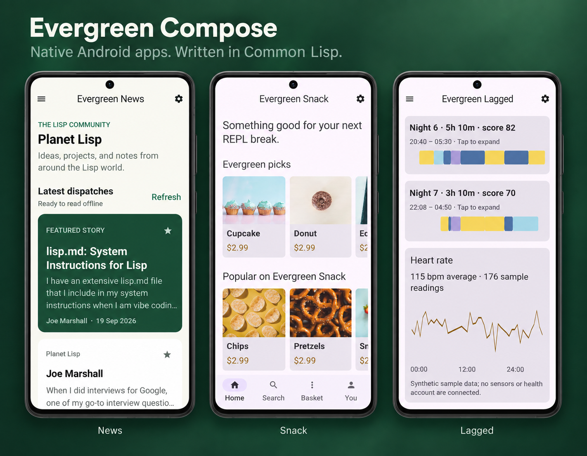

# Evergreen Compose

Build Android apps in [Evergreen Common Lisp](https://github.com/atgreen/evergreen),
using Jetpack Compose and Material 3.



[News](examples/evergreen-news) · [Snack](examples/evergreen-snack) ·
[Lagged](examples/evergreen-lagged) — three apps written in Common Lisp.

Version **0.0.1** is the first experimental baseline. See the
[changelog](CHANGELOG.md) for capabilities and known limits.

**Compose is the app model.** Write UI trees, state and callbacks in Lisp.
Evergreen Compose supplies a shared, precompiled Android runtime. Application builds require
EGCL and `egcl-target-android` (runtime API 4), **no JDK, Kotlin compiler, Gradle,
Android SDK or NDK**. Runtime maintainers use those tools to build the shared bundle.

**Develop inside the running app.** Connect Emacs with SLY or
[icl](https://github.com/atgreen/icl) to the phone's Lisp image through an
ADB-forwarded Slynk port. Evaluate Lisp, inspect application state, and update
the running UI without rebuilding or reinstalling the APK.
See [Live development with Slynk](#live-development-with-slynk).

```lisp
(defvar *count* 0)

(defun counter ()
  (evergreen-compose:ui :theme :children
    (list (evergreen-compose:ui :column :padding 24 :children
      (list (evergreen-compose:ui :button :id "counter"
                :text (format nil "Count: ~D" *count*)
                :on-click (lambda () (incf *count*))))))))

(defun android-main (window)
  (declare (ignore window))
  (evergreen-compose:run-compose-app #'counter))
```

A callback changes Lisp state; Evergreen Compose publishes a new tree. Compose handles
layout, text, accessibility, focus, scrolling and animation on Android's UI
thread. Scrolling does not call back into Lisp for each frame. Application
callbacks run on the Lisp worker, so they cannot block Android's UI thread.

Start with the complete [Hello Evergreen Compose app](examples/hello/app.lisp) and its
[ASDF definition](examples/hello/hello.asd). The [Compose guide](docs/COMPOSE.md)
explains components, callbacks, state, runtime extensions and packaging.
Browse the [76 shared controls](docs/COMPOSE-CONTROLS.md) or build the
[interactive catalog app](examples/catalog/app.lisp) to try them on a phone.

[Evergreen News](examples/evergreen-news/app.lisp) is a fuller example with Common
Lisp articles, bookmarks, interests, and light/dark themes. It adapts the JetNews
sample layout with original Lisp content and illustrations. Build
`evergreen-news/apk` from its [ASDF definition](examples/evergreen-news/evergreen-news.asd).

The six phone sample adaptations use the same shared runtime:

| App | Example | Try |
| --- | --- | --- |
| Evergreen News | `examples/evergreen-news` | Articles, bookmarks, interests |
| Evergreen Chat | `examples/evergreen-chat` | Local messages, channels, attachments, profiles |
| Evergreen Snack | `examples/evergreen-snack` | Search, favourites, quantities, basket |
| Reply | `examples/reply` | Read, star, archive, draft, reply locally |
| Evergreen Lagged | `examples/evergreen-lagged` | Sleep periods, expandable stages, heart-rate chart |
| Evergreen Caster | `examples/evergreen-caster` | Follow shows, save episodes, queue, audio playback |

Each directory has a matching `.asd`; load it and make `<directory-name>/apk`
as in the Hello build below. All six save their selected application state in private storage across restarts.
Evergreen News refreshes Planet Lisp, caches article text, and preserves bookmarks.
Evergreen Caster accepts an HTTPS podcast RSS/Atom URL (initially defn), caches
show notes and selections, and streams publisher audio/video. It also includes
six original offline Common Lisp episodes with synthetic narration. Queue
advance uses **Play next**; downloaded audio and background playback are not included.
Chat conversations, Reply mail, Snack orders and Lagged health readings remain
sample data; local edits persist and no messages or orders are sent.
Phone layouts use native scrolling; tablet-specific adaptive layouts are not
yet ported. Upstream credits and asset terms accompany each sample.

### Evergreen Sketchbook

[Sketchbook](examples/evergreen-sketchbook/app.lisp) is an original drawing sample:
finger/stylus ink, six colors, three brush sizes, undo/redo, a gallery, and named
sketches saved on the device. Its commented Lisp source owns all app logic. The
shared `:drawing-pad` control keeps active ink on the UI thread and reports
completed strokes to Lisp. Build `evergreen-sketchbook/apk` from its `.asd`.

## Live development with Slynk

The app exposes its live Lisp image through **Slynk**, the protocol used by
**Emacs with SLY** and [**icl**](https://github.com/atgreen/icl). With Slynk enabled
in your development build, launch the app and forward its port over ADB:

```sh
adb forward tcp:4005 tcp:4005
```

In Emacs, run `M-x sly-connect`, choose `127.0.0.1`, and enter port `4005`.
For a terminal REPL, connect with icl:

```sh
icl --connect 127.0.0.1:4005
```

You're evaluating code in the app's existing Lisp image, with its current state.
The Compose host polls Slynk and refreshes the UI after serving requests.

Slynk is opt-in: include EGCL-enabled Slynk sources in the development APK
(the [Slynk asset helper](tools/sync-slynk.sh) prepares them), along with an
`egcl.env` asset containing `EG_COMPOSE_LIVE_REPL=4005`. Declare these files as
ASDF file components so the APK builder includes them. The listener binds to
`127.0.0.1` on the device; ADB makes it accessible from your development machine.

## Build and run

On Fedora, install `egcl-target-android` from the EGCL package distribution; its
dependencies include matching EGCL and ADB. You also need this Evergreen Compose
distribution, including `runtime/compose-v1/`. No separate Quicklisp/ocicl setup
or dependency download is required to build an app.

The verified package pair is `egcl` / `egcl-target-android`
`0.0.1-6.fc44.x86_64`, containing `egcl-apk-asdf` and runtime
API 4. Fedora also installs a Java **runtime**, Python, Make and QEMU through
EGCL's package dependencies for its other workflows. Evergreen Compose's Lisp
APK builder does not invoke them. Other operating systems/package versions have
not been validated here.

From the extracted distribution or checkout:

```sh
EGCL_HEAP_MB=2048 egcl --no-init \
  --eval '(require :asdf)' \
  --eval '(asdf:load-asd (truename "evergreen-compose.asd"))' \
  --eval '(asdf:make "evergreen-compose/apk")'
```

This produces `build/evergreen-compose.apk`, signed with the local `.egcl-apk-key`. Keep that
private key to install future updates under the same identity. The larger heap
avoids a known EGCL allocation failure during APK ZIP/signing assembly.

The default demo uses the [Hello app](examples/hello/app.lisp): a counter, text
input, theme switch, dialog and scrolling list. The separate controls gallery
demonstrates the full catalog.

ADB is optional deployment tooling, not a build dependency:

```sh
adb install --user 0 -r build/evergreen-compose.apk
adb shell am start --user 0 -n dev.egcl.compose.demo/android.app.NativeActivity
```

To build the independent example with its own application ID:

```sh
EGCL_HEAP_MB=2048 egcl --no-init \
  --eval '(require :asdf)' \
  --eval '(asdf:load-asd (truename "evergreen-compose-build.asd"))' \
  --eval '(asdf:load-system "evergreen-compose-build")' \
  --eval '(asdf:load-asd (truename "examples/hello/hello.asd"))' \
  --eval '(asdf:make "hello/apk")'
```

Once Evergreen Compose is registered in ASDF's source registry, another project needs only
`:defsystem-depends-on ("evergreen-compose-build")`, `:class "evergreen-compose-build:compose-apk"` and
its application assets. Framework sources and the runtime are included for it.

## Validation

```sh
sh tools/check.sh                         # Portable protocol, state and example tests
XDG_CACHE_HOME=/tmp/evergreen-compose-cache egcl --no-init --load tests/asdf.lisp
sh tests/compose-no-toolchain.sh          # Fresh caches/environment; egcl-only PATH
shellcheck tools/*.sh tests/*.sh
sh tools/check-release.sh                # Complete CI/release archive and APK gate
```

The ASDF checks validate the distributed runtime's checksums and asset/load
consistency. They need `egcl-target-android`, but no SDK or JDK. Android-only
bridge tests are documented in the [Compose guide](docs/COMPOSE.md#runtime-maintainers).
Host checks cannot establish JNI, IME, lifecycle or device rendering behavior.

GitHub Actions runs the full archive/APK gate on pushes and pull requests.
Release automation supports matching version tags and manual build/test modes;
see [release automation](docs/RELEASING.md#github-actions).

Runtime contributors preparing a distribution should follow
[Preparing a source release](docs/RELEASING.md).

## Contributing and project policies

Start with [CONTRIBUTING.md](CONTRIBUTING.md) for setup, validation and pull
requests. Participation follows the [Code of Conduct](CODE_OF_CONDUCT.md).
Report suspected vulnerabilities through [SECURITY.md](SECURITY.md).
[CITATION.cff](CITATION.cff) provides citation metadata for research and published work.

## License

Evergreen Compose uses the same license as Evergreen Common Lisp:
**GPL-3.0-or-later WITH Classpath-exception-2.0**.
See [LICENSE](LICENSE), [the Classpath Exception](LICENSE.classpath-exception),
and [third-party notices](LICENSES.md).
